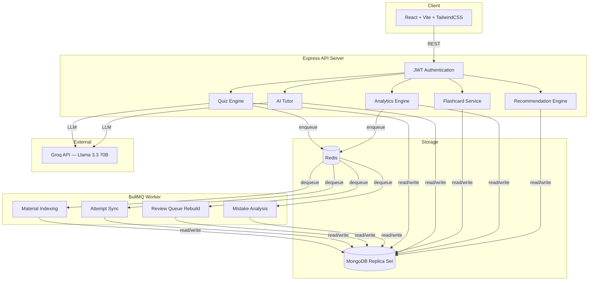
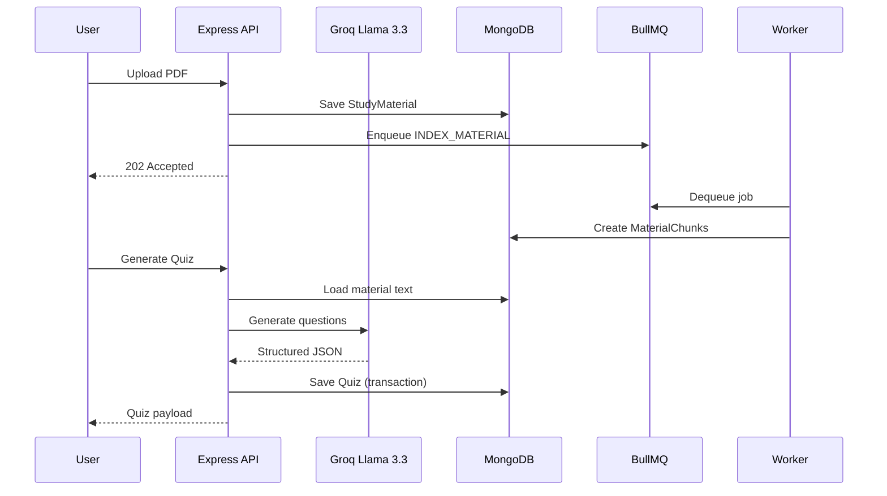

<div align="center">
  <h1>🏛️ AthenaeumAI</h1>
  <p><strong>AI-powered adaptive learning platform</strong></p>
  <p>Generates quizzes, flashcards, analytics, and tutoring experiences from uploaded study material.</p>

  <br />

  [](https://nodejs.org/)
  [](https://react.dev/)
  [](https://www.mongodb.com/)
  [](https://redis.io/)
  [](https://docs.docker.com/compose/)
  [](https://github.com/prathamkashyap/AthenaeumAI/releases)
  [](LICENSE)
</div>

---

## Why AthenaeumAI?

Most quiz generators are stateless — they produce questions and forget.

AthenaeumAI is different. It **remembers what you got wrong**, calculates how your knowledge is decaying over time, and surfaces the exact topics you need to review before they fade. It uses spaced repetition algorithms, an AI tutor grounded strictly in your uploaded material, and an asynchronous processing pipeline that handles everything from PDF parsing to mistake analysis in the background.

The result is a platform that adapts to how you actually learn, not just what you study.

---

## Architecture



---

## Screenshots

> Screenshots will be added after deployment. To preview, run `docker compose up --build` and visit `http://localhost:8080`.

---

## Features

| Category | Feature | Description |
| :--- | :--- | :--- |
| **PDF Processing** | Knowledge Extraction | Parses uploaded PDFs, chunks text, and indexes material for retrieval |
| **Quiz Generation** | Adaptive Difficulty | Generates quizzes using Llama 3.3 70B with configurable difficulty levels |
| **Spaced Repetition** | SM-2 Flashcards | Implements the SM-2 algorithm with ease factor clamping and interval scheduling |
| **Analytics** | Decay-Aware Tracking | Calculates per-topic retention scores using exponential decay over time |
| **AI Tutor** | RAG-Grounded Chat | Conversational tutor that answers strictly from uploaded study material |
| **Recommendations** | Weak Topic Surfacing | Automatically re-ranks the review queue based on weakness and confidence |
| **Background Jobs** | BullMQ Pipeline | Material indexing, attempt sync, and mistake analysis run asynchronously |
| **Authentication** | JWT + HttpOnly | Secure token-based auth with refresh token rotation |

---

## Tech Stack

**Frontend** — React 18, TypeScript, Vite, TailwindCSS, shadcn/ui, TanStack Query, React Router

**Backend** — Node.js 20+, Express 5, MongoDB (Mongoose 9 with transactions), Redis, BullMQ, Zod validation

**AI** — Groq API (Llama 3.3 70B), RAG retrieval, streaming tutor responses

**Infrastructure** — Docker Compose, Winston logging, OpenAPI/Swagger, GitHub Actions CI

---

## Folder Structure

```text
.
├── backend/
│   ├── config/            # Database, environment validation (Zod)
│   ├── controllers/       # Route handlers
│   ├── middleware/         # Auth, error handling, rate limiting, validation
│   ├── models/            # Mongoose schemas (12 models)
│   ├── routes/            # Express route definitions
│   ├── services/          # Business logic, AI, analytics, recommendations
│   ├── utils/             # BullMQ queue, logger, transactions, errors
│   ├── tests/             # Jest unit + integration tests
│   ├── worker.js          # Dedicated BullMQ consumer process
│   └── server.js          # HTTP entry point
├── src/
│   ├── components/        # shadcn/ui + custom components
│   ├── context/           # Auth + Quiz context providers
│   ├── lib/               # API client utilities
│   └── pages/             # Lazy-loaded route views
├── docs/                  # Architecture, ADRs, API reference
├── tests/                 # Playwright E2E tests
├── docker-compose.yml     # Full-stack orchestration
└── .github/workflows/     # CI pipeline
```

---

## System Design

### Quiz Generation Pipeline



### Adaptive Learning Pipeline

1. **Attempt Submission** — User answers are validated and persisted atomically via Mongoose transactions.
2. **Background Sync** — A BullMQ job updates `UserProgress` per-topic mastery, records `LearningEvents`, and triggers mistake analysis for incorrect answers.
3. **Decay Calculation** — The analytics engine applies exponential decay to per-topic confidence based on time since last practice.
4. **Review Queue** — The recommendation service re-ranks topics by weakness score and populates the review queue with overdue flashcards and low-confidence topics.

### AI Tutor Pipeline

The tutor is strictly RAG-grounded to prevent hallucination:
1. The user's query is combined with their session history.
2. The embedding service retrieves relevant chunks from the uploaded material.
3. A constrained system prompt instructs the LLM to answer **only** from the provided context.

---

## Installation

### Prerequisites
- Node.js v20+
- Docker & Docker Compose
- [Groq API Key](https://console.groq.com/)

### Docker (Recommended)

```bash
git clone https://github.com/prathamkashyap/AthenaeumAI.git
cd AthenaeumAI

# Configure environment
cp backend/.env.example backend/.env
# Edit backend/.env with your GROQ_API_KEY and JWT_SECRET

# Start all services
docker compose up --build -d
```

Frontend: `http://localhost:8080` · API: `http://localhost:5000` · Swagger: `http://localhost:5000/api-docs`

### Local Development

```bash
# Install dependencies
npm install && cd backend && npm install && cd ..

# Start MongoDB replica set and Redis locally, then:

# Terminal 1 — API server
cd backend && npm run dev

# Terminal 2 — Background worker
cd backend && node worker.js

# Terminal 3 — Frontend
npm run dev
```

---

## Environment Variables

| Variable | Required | Description |
| :--- | :---: | :--- |
| `NODE_ENV` | ✓ | `development` or `production` |
| `PORT` | | API port (default `5000`) |
| `MONGODB_URI` | ✓ | Replica set connection string |
| `REDIS_HOST` | | Redis hostname (default `localhost`) |
| `REDIS_PORT` | | Redis port (default `6379`) |
| `JWT_SECRET` | ✓ | 256-bit secret for token signing |
| `GROQ_API_KEY` | ✓ | Groq API access token |
| `FRONTEND_URL` | ✓ | Allowed CORS origin |

See [`backend/config/env.js`](backend/config/env.js) for Zod validation schema.

---

## Testing

```bash
# Frontend unit tests (Vitest)
npm test

# Backend unit tests (Jest) — 118 tests across 6 suites
cd backend && npm run test:unit

# Backend integration tests (requires MongoDB + Redis)
cd backend && npm run test:integration

# E2E tests (Playwright)
npm run test:e2e

# Backend syntax check
cd backend && npm run build
```

---

## Deployment

The repository ships with production-ready Dockerfiles:

- **Frontend** — Vite build served via Nginx (`Dockerfile`)
- **Backend** — Node Alpine image for the API server (`backend/Dockerfile`)
- **Worker** — Same backend image running `worker.js` as an independent container

Recommended production stack:
- **MongoDB** → Atlas (M10+ with replica set)
- **Redis** → Upstash or ElastiCache
- **Backend + Worker** → Railway, Render, or AWS ECS
- **Frontend** → Vercel or AWS Amplify

---

## Roadmap

- [x] PDF upload and parsing
- [x] AI quiz generation with quality filtering
- [x] Adaptive difficulty and per-topic mastery
- [x] SM-2 spaced repetition flashcards
- [x] Analytics dashboard with decay-aware retention
- [x] AI tutor with RAG grounding
- [x] BullMQ background processing with reliability hardening
- [x] Docker Compose orchestration
- [x] CI pipeline (GitHub Actions)
- [ ] **Phase 6:** Sentence Transformer embeddings + Qdrant vector search
- [ ] **Phase 7:** Hybrid retrieval with cross-encoder reranking

---

## License

[MIT](LICENSE)
