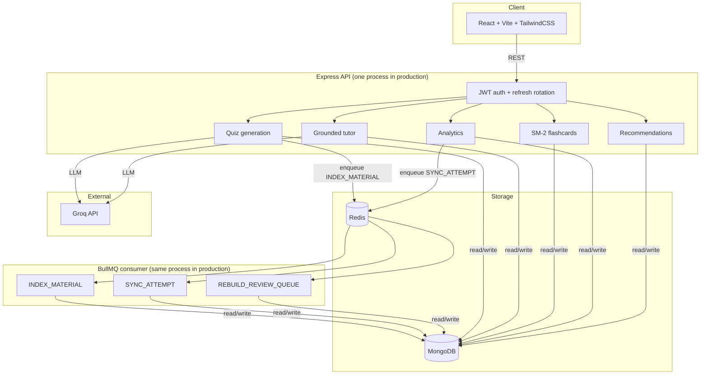

<div align="center">
  <h1>AthenaeumAI</h1>
  <p><strong>Adaptive learning platform built on your own study material</strong></p>
  <p>Ingest material, generate grounded assessments, record attempts, track mastery and forgetting, and schedule revision from what you actually got wrong.</p>

  <br />

  [](https://nodejs.org/)
  [](https://react.dev/)
  [](https://www.mongodb.com/atlas/)
  [](https://redis.io/)
 [](https://docs.docker.com/compose/)
  [](LICENSE)
</div>

---

## What AthenaeumAI does

Most quiz generators are stateless — they produce questions and forget.

AthenaeumAI records what you answered, derives a per-topic mastery and confidence state from those records, decays that state as time passes, and schedules revision from the topics you have not yet proved you know. The LLM writes questions and explanations. It does **not** compute mastery, confidence, decay or the review schedule — those are deterministic calculations over stored attempts, and the distinction is maintained deliberately.

The retrieval that grounds the tutor is a **lexical baseline, not semantic search**. See [Retrieval](#retrieval-what-the-tutor-actually-searches) for exactly what it does and does not do.

---

## Architecture


```mermaid
graph TB
    subgraph Client
        UI[React + Vite + TailwindCSS]
    end

    subgraph API["Express API (one process in production)"]
        Auth[JWT auth + refresh rotation]
        QE[Quiz generation]
        Tutor[Grounded tutor]
        FC[SM-2 flashcards]
        Analytics[Analytics]
        Rec[Recommendations]
    end

    subgraph Worker["BullMQ consumer (same process in production)"]
        IDX[INDEX_MATERIAL]
        SYNC[SYNC_ATTEMPT]
        RBQ[REBUILD_REVIEW_QUEUE]
    end

    subgraph Storage
        Mongo[(MongoDB)]
        Redis[(Redis)]
    end

    subgraph External
        Groq[Groq API]
    end

    UI -->|REST| Auth
    Auth --> QE & Tutor & FC & Analytics & Rec
    QE & Tutor -->|LLM| Groq
    QE -->|enqueue INDEX_MATERIAL| Redis
    Analytics -->|enqueue SYNC_ATTEMPT| Redis
    Redis --> IDX & SYNC & RBQ
    IDX & SYNC & RBQ -->|read/write| Mongo
    QE & Tutor & FC & Analytics & Rec -->|read/write| Mongo
```

Mistake analysis, spaced-repetition scheduling and every mastery calculation run **inline in the request**, not in the queue. Only two jobs are enqueued by the API today: `INDEX_MATERIAL` after a quiz is generated, and `SYNC_ATTEMPT` after an attempt is recorded. `REBUILD_REVIEW_QUEUE` is handled by the worker but is not currently triggered by any route.

---

## Synchronous vs background

This is the distinction most worth stating precisely, because "asynchronous pipeline" is easy to overclaim.

**Synchronous, inside the HTTP request:**

| Operation | Where |
| :--- | :--- |
| Quiz generation — the provider calls | `quizController.js` → `aiQuizService.generateQuiz` |
| Mistake analysis for incorrect answers | `quizController.js` → `mistakeAnalysisService` |
| SM-2 scheduling, analytics, recommendations, review-queue reads | services, on-request |
| Tutor answer (non-streaming and SSE) | `tutorController.js` |

**Background, via BullMQ:**

| Job | Enqueued by | Does |
| :--- | :--- | :--- |
| `INDEX_MATERIAL` | `POST /quiz/generate`, after commit | chunk and index material for retrieval |
| `SYNC_ATTEMPT` | `POST /quiz/:id/attempt`, after commit | apply learner effects: mastery, confidence, events, mistake analysis records |
| `REBUILD_REVIEW_QUEUE` | worker-supported, no current route trigger | recompute the review queue |

Two consequences worth knowing:

- **Quiz generation is a synchronous request that can take minutes.** It is not queued. See [Known production limitation](#known-production-limitation-reasoning-model-latency).
- **Durable work is committed before its job is scheduled.** If Redis is unavailable at that point the business write has already succeeded. The response is still truthful — it carries `backgroundProcessing: { "status": "not_scheduled", ... }` — but the background work genuinely has not run, and nothing re-enqueues it automatically. `INDEX_MATERIAL` self-heals on read; `SYNC_ATTEMPT` is retryable by the client via `POST /api/v1/jobs/:id/retry`. Details in [`docs/KNOWN_LIMITATIONS.md`](docs/KNOWN_LIMITATIONS.md).

---

## The learning loop

The adaptive behaviour is **deterministic and rule-based**, not a trained personalisation model. Given the same attempts it produces the same state.

1. **Attempt recorded** — the attempt is persisted first, with a durable per-attempt claim so a redelivered `SYNC_ATTEMPT` applies its effects exactly once.
2. **Learner effects applied** — `SYNC_ATTEMPT` updates `UserProgress` per topic: mastery from accuracy, confidence from a weighted blend of accuracy, recency and existing confidence (`progressService.js`: `0.5·accuracy + 0.3·recency + 0.2·confidence`).
3. **Decay applied** — per-topic retention decays exponentially with time since last practice: `100 · e^(−elapsedDays / 21)` (`progressService.js`). The dashboard's aggregate `retentionScore` uses a separate linear penalty; these are two different figures and are not the same number.
4. **Weakness ranked** — a topic's weakness score is `0.55·mastery + 0.3·confidence + 0.15·(100 − weaknessDrag)`, which re-ranks the review queue (`recommendationService.js`).
5. **Review scheduled** — flashcards follow SM-2 with ease-factor clamping and a 6-day second interval (`flashcardService.js`); failed questions become review items scoped to the attempt.

Achievements are rule-based too. Nothing on the dashboard or profile is inferred or predicted.

---

## Retrieval: what the tutor actually searches

Stated plainly, because "RAG" would overstate it.

The shipped retriever is `local-hash-v1` (`backend/services/embeddingService.js`):

- Tokenise, drop stop words, hash each token with **FNV-1a** into one of 384 dimensions with a sign bit, and L2-normalise.
- Score by **cosine similarity** between the query vector and each chunk vector.
- Blend with a lexical keyword-overlap score: `0.78 · vector + 0.22 · lexical`.

Every component is lexical. There is no learned embedding model, no sentence transformer and no vector database — two texts using different wording for the same concept can score near zero. That is a deliberate baseline that is measured and documented, not an oversight.

A full **BM25** implementation exists in `backend/services/bm25Retriever.js`, but it is imported only by its own tests. It is an evaluation candidate, not the active retriever.

The tutor additionally gates on evidence **before** calling the model: if retrieval returns nothing, or every score is exactly zero, it refuses rather than answering ungrounded. That gate detects *absent* evidence only — it cannot detect a confidently-retrieved wrong chunk, and the measured score ranges show why no numeric threshold could. See [`docs/KNOWN_LIMITATIONS.md`](docs/KNOWN_LIMITATIONS.md).

The tutor has **no conversational memory**. Each query retrieves fresh and answers from retrieved context alone. `GET /api/v1/tutor/history` returns an audit log of past interactions (topic, question, result, timestamp) reconstructed from `LearningEvent` records — it is a history of what was asked, not a transcript the model can recall.

---

## Where the LLM is actually used

| Used for | Not used for |
| :--- | :--- |
| Writing questions, options, explanations and difficulty | Scoring answers — the stored selection is the record |
| Tutor answers, constrained to retrieved context | Deciding whether retrieval was good enough |
| Mistake diagnosis text | Any mastery, confidence, decay or scheduling number |

The provider is resolved per call. The model is `process.env.GROQ_MODEL || "openai/gpt-oss-120b"` (`groqProvider.js`) — configurable by environment variable precisely so a provider-side model retirement is a config change rather than a code change. The previous hard-coded default was retired by Groq and returned 404 `model_not_found` on every AI feature; it is named only in the source comment recording that incident.

---

## Features

| Category | Feature | Description |
| :--- | :--- | :--- |
| **PDF processing** | Material ingest | Extracts text, chunks at 1800 chars with 260 overlap, indexes for lexical retrieval |
| **Quiz generation** | Grounded generation | Questions written from uploaded text, with explanations and per-question topics |
| **Attempts** | Durable recording | Attempts persisted before effects are applied, with an idempotent claim |
| **Mastery** | Per-topic state | Mastery, confidence and exponentially decayed retention computed from real attempts |
| **Spaced repetition** | SM-2 flashcards | Ease-factor scheduling with interval progression |
| **Review queue** | Failure-driven | Overdue flashcards, failed questions and weak topics, ranked by weakness |
| **Analytics** | Attempt-derived | Accuracy trends, weak topics, mastery and readiness |
| **AI tutor** | Grounded answers | Lexical retrieval plus a pre-model evidence gate; SSE streaming available |
| **Achievements** | Rule-based | Unlocked from recorded events, never inferred |
| **Auth** | JWT + httpOnly rotation | Access token plus rotated refresh token in an httpOnly cookie |
| **Public site** | Marketing page | `/` is public; the workspace is `/dashboard` |

---

## Tech stack

**Frontend** — React 18, TypeScript 5.8, Vite 5, TailwindCSS 3, shadcn/ui, TanStack Query 5, React Router 6, Lucide

**Backend** — Node.js 20+, Express 5, Mongoose 9 (transactions), MongoDB, Redis via ioredis, BullMQ 5, Zod 4, Winston

**AI** — Groq (`openai/gpt-oss-120b` by default, `GROQ_MODEL`-overridable), lexical retrieval, optional SSE streaming

**Infrastructure** — Docker Compose, GitHub Actions CI, Vitest, Jest, Playwright, OpenAPI/Swagger

---

## Folder structure

```text
.
├── backend/
│   ├── config/            # database, Zod environment validation
│   ├── controllers/       # route handlers
│   ├── middleware/        # auth, error handling, rate limiting, validation
│   ├── models/            # Mongoose schemas (12 models)
│   ├── routes/            # Express route definitions
│   ├── services/          # business logic, AI, retrieval, analytics, recommendations
│   ├── utils/             # BullMQ queue, logger, transactions, PDF parsing, chunking
│   ├── tests/             # Jest unit + integration
│   ├── worker.js          # BullMQ consumer
│   ├── main.js            # combined server + worker entry (production)
│   └── server.js          # HTTP-only entry
├── src/
│   ├── components/        # app shell, landing page, shadcn/ui
│   ├── context/           # auth + quiz providers
│   ├── lib/               # API client, theme, topic identity, public copy
│   └── pages/             # route views
├── docs/                  # architecture, ADRs, API reference, evaluations
├── tests/e2e/             # Playwright
├── render.yaml            # Blueprint for the deployed topology
├── docker-compose.yml     # full local stack
└── .github/workflows/     # CI
```

---

## Installation

### Prerequisites

- Node.js v20+
- Docker & Docker Compose
- [Groq API key](https://console.groq.com/)

### Docker (recommended)

```bash
git clone https://github.com/prathamkashyap/AthenaeumAI.git
cd AthenaeumAI

cp backend/.env.example backend/.env
# Edit backend/.env with GROQ_API_KEY and JWT_SECRET

docker compose up --build -d
```

Frontend `http://localhost:8080` · API `http://localhost:5000` · Swagger `http://localhost:5000/api-docs`

Compose runs MongoDB as a single-node replica set, which is required — see [transaction support](#transactions-require-a-replica-set).

### Local development

```bash
npm install && cd backend && npm install && cd ..

# Terminal 1 — API server
cd backend && npm run dev

# Terminal 2 — background worker
cd backend && node worker.js

# Terminal 3 — Frontend
npm run dev
```

---

## Environment variables

Validated by Zod at startup in [`backend/config/env.js`](backend/config/env.js).

| Variable | Required | Description |
| :--- | :---: | :--- |
| `GROQ_API_KEY` | ✓ | Groq API access token |
| `MONGODB_URI` | ✓ | MongoDB connection string; must reach a replica set or sharded cluster |
| `JWT_SECRET` | ✓ | Secret for token signing |
| `NODE_ENV` | | `development` \| `production` \| `test` (default `development`) |
| `PORT` | | API port (default `5000`) |
| `GROQ_MODEL` | | Override the generation model (default `openai/gpt-oss-120b`) |
| `REDIS_URL` | | Managed Redis connection string; takes precedence over host/port |
| `ALLOWED_ORIGINS` | production | Comma-separated CORS allowlist; **required** in production |

In production an empty `ALLOWED_ORIGINS` allows no browser origin at all.

---

## Testing

Measured on `main` (`9bc6029`). Every figure below is from an actual run.

```bash
# Frontend unit tests (Vitest) — 374 tests across 29 files
npm test

# Backend unit tests (Jest) — 942 tests across 36 suites
cd backend && npm run test:unit

# Backend integration tests — 101 passed, 13 skipped
# requires MongoDB + Redis; runs serially
cd backend && npm run test:integration

# E2E tests (Playwright) — 26 passed, 2 skipped
npm run test:e2e

# Typecheck, lint, build
npm run typecheck
npm run lint
npm run build
```

| Suite | Result |
| :--- | :--- |
| Frontend (Vitest) | 374 passed / 29 files |
| Backend unit (Jest) | 942 passed / 36 suites |
| Backend integration (Jest) | 101 passed, 13 skipped / 114 total |
| Browser E2E (Playwright) | 26 passed, 2 skipped |
| `typecheck` · `lint` · `build` | pass |

The 13 skipped integration tests and 2 skipped E2E tests are gated behind opt-in flags (`E2E_REAL_QUEUE` and similar) that require live infrastructure; they skip loudly rather than passing without having proved anything.

---

## Deployment

### Production topology

Deployed on **Render free tiers only** — no paid plan, no card. Defined in [`render.yaml`](render.yaml):

| Component | Plan | Detail |
| :--- | :--- | :--- |
| `athenaeum-frontend` | free static site | `npm run build`, serves `./dist`, `VITE_API_ROOT` set at build time |
| `athenaeum-api` | free web service | `npm run start:combined` → `node main.js` |
| `athenaeum-redis` | free Key Value | BullMQ backing store |
| MongoDB | Atlas **M0** | free shared cluster |

`main.js` starts the HTTP server **and** the BullMQ consumer in one process, so the queue is drained without a second service. `autoDeployTrigger` is `off` on both services: **a merge does not deploy.** Redeploy deliberately.

### Docker images

- **Frontend** — Vite build served by Nginx
- **Backend** — Node Alpine image; `server.js` for HTTP-only, `main.js` for combined, `worker.js` for worker-only

### Transactions require a replica set

`POST /quiz/generate` writes material and quiz in one transaction, and `SYNC_ATTEMPT` claims the attempt and applies learner effects in one transaction. A standalone `mongod` cannot do this. The deployment is probed at connect time via `hello` and reports `transactions: supported | unsupported | unknown` on `GET /api/v1/health`; transaction-backed paths refuse with `503` rather than silently degrading. Atlas M0 and the Compose replica set both satisfy this.

### Known production limitation: reasoning-model latency

Every model currently reachable on the configured Groq key is a **reasoning** model, so it spends part of its token budget reasoning before answering. Measured end to end, a five-question quiz takes **117–244s**. The tutor is unaffected in practice (~7s).

Generation is synchronous and makes up to three sequential provider calls (first, middle and last chunk of the extracted text). Each individual call is bounded by a 30s completion timeout (`AI_COMPLETION_TIMEOUT_MS`), so no single call trips it — the wall-clock is the sum. This is a real user-visible wait on the primary action. It is recorded in [`docs/DEPLOYMENT.md`](docs/DEPLOYMENT.md) and is the first roadmap item.

---

## Roadmap

### Shipped

- [x] PDF upload, parsing and lexical indexing
- [x] Grounded quiz generation with quality filtering
- [x] Per-topic mastery, confidence and exponential decay from real attempts
- [x] SM-2 spaced-repetition flashcards
- [x] Review queue ranked by weakness, with attempt-scoped snooze
- [x] Analytics dashboard and recommendations
- [x] Grounded tutor with a pre-model evidence gate and optional SSE streaming
- [x] BullMQ background processing with tracked job status, durable claims and client retry
- [x] Rule-based achievements, truthful empty states
- [x] Public landing page, consolidated brand identity, SEO metadata
- [x] Docker Compose orchestration and free-tier Render deployment
- [x] CI pipeline (GitHub Actions) gating typecheck, lint, build, unit, integration and E2E

### Deferred — not implemented

- [ ] **Generation latency.** Streaming or partially-generated quizzes, so the first questions are usable before the last is written.
- [ ] **Semantic retrieval.** Sentence-transformer embeddings plus a vector store, replacing `local-hash-v1`. Deferred deliberately: the lexical baseline is measured first (see [`docs/RETRIEVAL_EVALUATION.md`](docs/RETRIEVAL_EVALUATION.md)) so any change is justified by evidence of a plateau rather than by assumption. BM25 is implemented and available for that comparison.
- [ ] **Hybrid retrieval with cross-encoder reranking.** Depends on the above.
- [ ] **Transactional outbox and HTTP idempotency keys** for background-work scheduling.
- [ ] **Automatic terminal-job recovery** — reconciliation instead of user-triggered retry.
- [ ] **Security, observability and performance hardening** as a documented contract: rate-limit and payload budgets per route, structured audit logging, latency and error instrumentation, and load testing. None of this is in place today.
- [ ] **Tutor conversational memory**, if product value justifies the persistence cost.

---

## Known limitations

[`docs/KNOWN_LIMITATIONS.md`](docs/KNOWN_LIMITATIONS.md) is the authoritative list. In brief: lexical retrieval with no semantic matching, reasoning-model generation latency, a grounding gate that detects absent rather than wrong evidence, background work committed before it is scheduled, no HTTP idempotency on attempt submission, topic-item snoozes that a rebuild resets, and the flashcard `due_flashcard` ↔ `overdue_review` identity boundary.

---

## License

[MIT](LICENSE)
