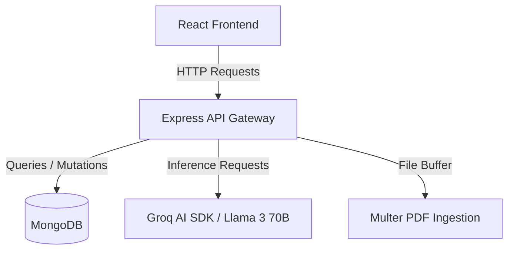
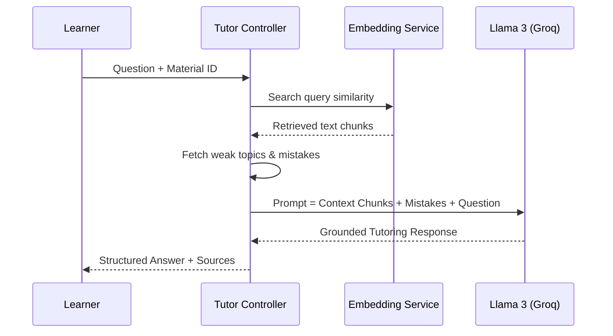

# AthenaeumAI Architecture

This document describes the architectural layout, data flow, and components of the AthenaeumAI platform.

---

## 🗺️ High-Level System Architecture

AthenaeumAI is structured as a decoupled full-stack web application:

- **Client**: React 18, TypeScript, Tailwind CSS, Shadcn UI.
- **Server**: Node.js, Express, Winston Logger, Zod request validation.
- **Database**: MongoDB (Mongoose ODM).
- **AI Service**: Groq API (Llama 3 70B).

---

## 🎨 Frontend Architecture

The frontend is a single-page application built with Vite:

### Contexts
- **AuthContext**: Manages JWT token persistence, active user object, login, signup, and logout actions.
- **QuizContext**: Orchestrates the state machine of the active quiz (generation, question progress, timer, attempt submissions, and mistake analysis display).

### API Helper
- **`src/lib/api.ts`**: Standard Axios wrapper enforcing base headers, authentication tokens, and handling token expiration or network failures.

### Interactive Components
- **`AppSidebar`**: Provides primary navigation.
- **`StarryBackground` & `ThemeToggle`**: Implements custom canvas animations and manages theme transitions (Starry, Academia, Light).

---

## ⚙️ Backend Architecture

The backend is structured into modular layers:

- **Server Entrypoint (`server.js`)**: Connects to the database, configures standard middleware (cors, json, urlencoded, logging, request correlation ID, rate limiters), and mounts versioned API routes under `/api/v1/` (with compatibility aliases under `/api/`).
- **Routes (`routes/`)**: Exposes public and requireAuth protected REST API endpoints.
- **Controllers (`controllers/`)**: Thin layers extracting params, calling validation, invoking corresponding services, and formatting API responses.
- **Services (`services/`)**: Houses business logic, AI prompt templates, scoring, retrieval algorithms, spaced-repetition rules, and event triggers.
- **Models (`models/`)**: Declares persistent schemas.

---

## 💾 Database Schema & State

AthenaeumAI maps learning states across nine schemas:

1. **User**: Learner credentials, profile (program, semester), and study streak tracking.
2. **StudyMaterial**: Stores metadata, tags, text contents, and upload path for PDFs.
3. **MaterialChunk**: Holds chunked text segments and their corresponding vector representation (for RAG).
4. **Quiz**: Stores generated assessment questions, difficulty, and references to study material.
5. **QuizAttempt**: Records detailed scores, accuracy, duration, answer options selected, and AI Distractor analyses.
6. **UserProgress**: Tracks topic-level mastery values, confidence ratings, weakness metrics, and recommended difficulty levels.
7. **FlashcardSet**: Contains card items and metadata for review schedules.
8. **LearningEvent**: Append-only audit stream tracking user study activity.
9. **ReviewQueue**: Standard revision items scheduled for active recall.

---

## 🧠 AI Services & Tutor Pipeline

### Contextual AI Tutor (RAG Flow)

### Recommendation Engine
Centralizes adaptive rules:
- **Readiness Score**: Formulated from cumulative accuracy, recent topic attempts, and time-weighted decay.
- **Optimal Next Action**: Evaluates review queue backlog, due flashcards, and weak topics to suggest the next study activity.

---

## 🧪 Testing & Verification Architecture

AthenaeumAI includes a comprehensive, multi-tiered testing and verification system:

### 1. Programmatic Demo Seeder
- **Location**: `backend/scripts/seedDemo.js`
- **Purpose**: Clears the database and inserts a realistic 30-day completed student learning journey. It seeds a user, study materials, text chunks, 12 quiz attempts with historical timestamps, flashcard decks, 15 spaced-repetition review queue items, weak topics, and tutor chat histories.
- **Verification**: Running `npm run verify:demo` runs query assertions checking counts across all models.

### 2. Pre-flight Smoke Test Suite
- **Location**: `backend/scripts/smokeTest.js`
- **Purpose**: Runs connectivity validation for MongoDB, checks the versioned public health endpoints, tests the login flow with the seeded user, and checks protected route token headers.

### 3. Playwright E2E Testing & Mocking
- **Location**: `tests/e2e/flow.spec.ts`
- **API Mocking**: Playwright intercepts browser network calls (`page.route()`) targeting `/api/quiz/generate` and `/api/tutor/ask` to return mock JSON payloads. This eliminates external Groq API reliance, prevents network rate limits, and enables deterministic offline test execution.
- **Coverage**: Includes auth page loading, dashboard status rendering, PDF document uploading, and Socratic tutor interactions.
